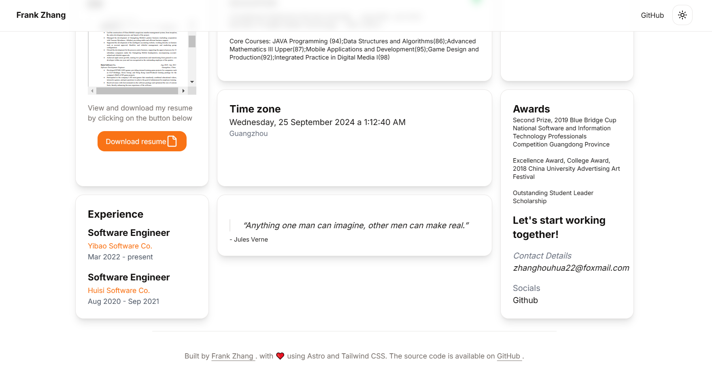

# Astro Portfolio

This portfolio using Astro, Tailwind CSS, and Shadcn UI.

## Design




## Technologies Used

This project utilizes the following technologies:

- **Astro**: A modern framework for building fast and efficient websites.
- **Tailwind CSS**: A utility-first CSS framework for rapid and responsive design.
- **Shadcn UI**: A collection of accessible and easy-to-use UI components.
- **React**: For interactive components and advanced functionality.
- 
## Project Structure

A brief overview of the project structure:

- **/public**: Images and other static files.
- **/src**: Contains all Astro components and pages.
- **/styles**: Custom CSS files.
- **astro.config.mjs**: Main configuration for Astro.
- **tailwind.config.js**: Configuration for Tailwind CSS.
- 
## Requirements

Before starting, make sure you have the following requirements installed:

- Node.js (version 14 or higher)
- npm or yarn

## Installation

To install and run the project locally, follow these steps:

1. Navigate to the project directory:

   ```bash
   cd astro-portfolio
   ```

2. Install the dependencies:

   ```bash
   npm install
   # or
   yarn install
   ```

3. Start the development server:

   ```bash
   npm run dev
   # or
   yarn dev
   ```
